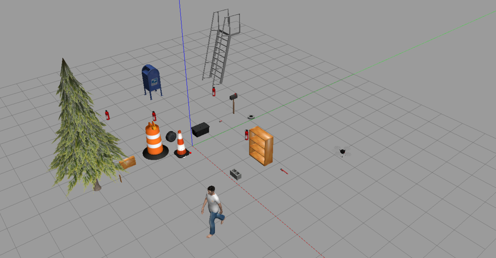
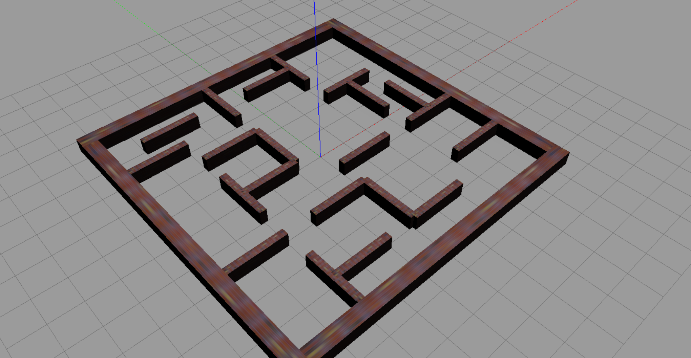
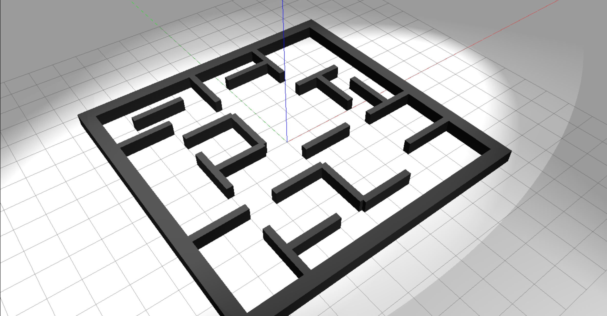
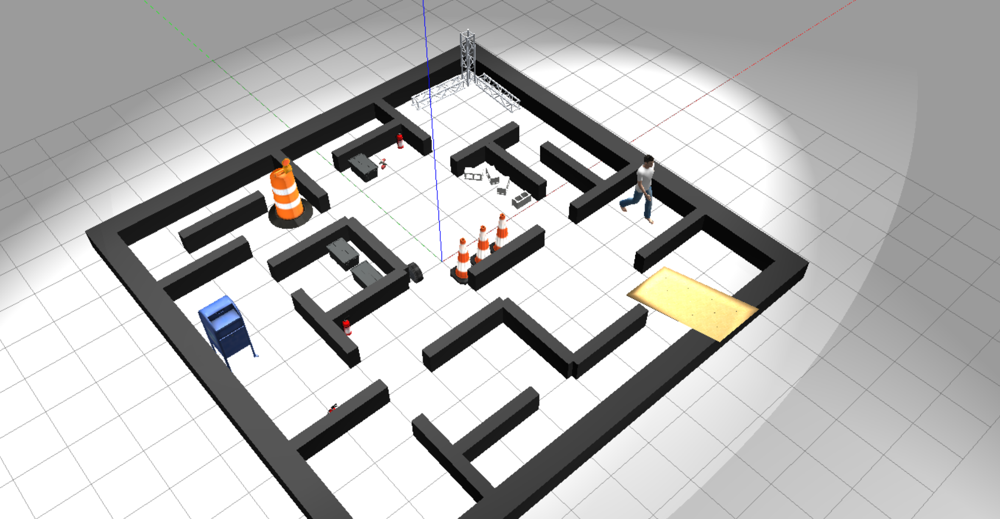
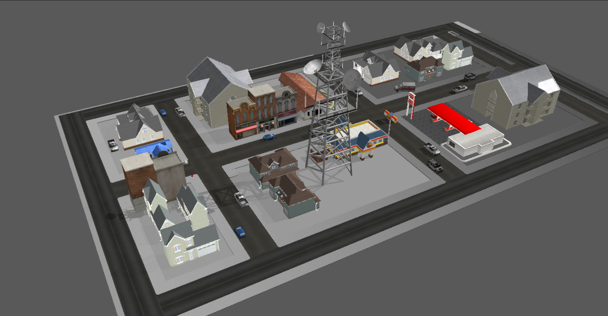

# coop_work_pkg
KHU 캡스톤디자인 Drones and Rovers for Extraterrestrial Autonomous Mapping(**DREAM**) 팀.

Drone-Rover간의 협업으로 3D Reconstruction을 수행하는 프로젝트 리포지토리입니다.

## 사용 방법

1. `<워크스페이스>/src/` 아래에 리포지토리를 clone.
    
    ```bash
    $ cd <workspace>/src
    $ git clone https://github.com/kodogyu/coop_work_pkg.git
    ```
    
2. `<워크스페이스>`에서 빌드.
    
    ```bash
    $ cd ../
    $ colcon build
    ```
    
3. 워크스페이스의 `setup.bash` 파일 실행.
    
    ```bash
    $ source <workspace>/install/setup.bash
    ```
    
4. 이제 `coop_work_pkg` 패키지를 사용할 수 있습니다.


## URDFs

- common_properties.urdf : burger, waffle 공통으로 사용되는 요소들에 대한 파일입니다.
- turtlebot3_burger.urdf : turtlebot3 burger 모델입니다.
- turtlebot3_waffle.urdf : turtlebot3 waffle 모델입니다.
- turtlebot3_waffle_pi.urdf : turtlebot3 waffle pi 모델입니다.
- turtlebot3_waffle_depth.urdf : depth 카메라를 탑재한 waffle 모델입니다.
- turtlebot3_waffle_mk0.urdf : RGB 카메라와 라이다가 평행하게 위치하도록 수정한 waffle 모델입니다.
- turtlebot3_waffle_stereo.urdf : stereo 카메라를 탑재한 waffle 모델입니다.


## Nodes

- **drone_controller** : PX4의 SITL (시뮬레이션 환경)에서 실행된 드론을 제어하는 노드입니다. ```keyboard_reader``` 노드와 함께 실행하여 드론을 조작할 수 있습니다.
- **keyboard_reader** : 키보드의 입력을 받아 ```drone_controller``` 노드가 드론을 제어할 수 있도록 적절한 topic을 전달합니다. 드론의 움직임과 카메라 짐벌의 움직임을 조작할 수 있습니다.
- **drone_image_capture_server** : 드론의 카메라가 촬영하는 이미지를 저장하는 server를 실행합니다.
- **teleop_custom** : 터틀봇의 움직임을 조작하는 노드입니다. [teleop_keyboard](https://github.com/ROBOTIS-GIT/turtlebot3/blob/humble-devel/turtlebot3_teleop/turtlebot3_teleop/script/teleop_keyboard.py) 노드에서 터틀봇의 제한 속도를 수정하였습니다.


## Launch files

- **load_coop_robot.launch.py** : 현재 띄워져있는 Gazebo 월드에 터틀봇을 추가로 로드합니다. ```TURTLEBOT3_MODEL``` 환경변수를 **URDF**에 존재하는 모델로 설정하면 해당 모델이 시뮬레이터에 로드됩니다.
```
export TURTLEBOT3_MODEL=<model name>
```
- **turtlebot3_maze.launch.py** : ```maze_under_construct.world``` Gazebo 환경을 실행하고 터틀봇을 로드합니다.
- **planner_only.launch.py** : Gazebo와 navigation 기능을 실행합니다. 
- **bringup_launch.py** : NAV2, SLAM, Localization 기능을 불러옵니다. 홀로 사용되지 않고 ```planner_only.launch.py``` 실행 시 호출됩니다.
- **navigation_launch.py** : NAV2 스택을 실행합니다. 단독으로 사용되지 않고 ```bringup_launch.py``` 실행 시 호출됩니다.
- **robot_state_publisher.launch.py** : urdf 파일을 읽어 로봇의 state를 publish합니다. 단독으로 사용되지 않고 ```turtlebot3_maze.launch.py```  
  실행 시 호출됩니다.
- **spawn_turtlebot3.launch.py** : ```TURTLEBOT3_MODEL``` 환경변수에 지정된 터틀봇 모델의 sdf 파일을 읽어 Gazebo 시뮬레이터에 로드합니다.  
  단독으로 사용되지 않고 ```turtlebot3_maze.launch.py``` 실행 시 호출됩니다.


## Worlds

### border.world

지형 없이 다양한 물체들에 대해서만 테스트 하기 위한 월드입니다.

### maze.world

벽돌무늬의 미로 형태 월드입니다.

### maze_light.world

**maze.world**에서 부족한 빛을 보완한 월드입니다.

### maze_under_construct.world

**maze_light.world**에서 공사장 컨셉의 다양한 물체들을 추가한 월드입니다.

### small_city.world

실세계를 대상으로 시뮬레이션 하기 위한 월드입니다.

## 참고 자료

아래의 오픈소스/문서를 참고하였습니다.

- https://github.com/ROBOTIS-GIT/turtlebot3_simulations
- https://github.com/Jaeyoung-Lim/px4-offboard
- https://github.com/PX4/px4_ros_com
- https://github.com/ros-planning/navigation2/tree/humble
